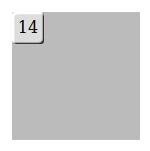
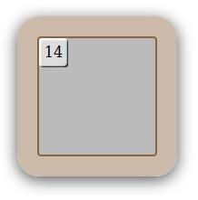

# sliding-puzzle-slider
## Adding DIVs

You start with this code in the body of your HTML page:
```html
<div id="grid"></div>
```

Could you provide a function called `createCells()` that will add 15 DIVs to the __grid__ and return an array of them?
The text content of the first cell will be "1", the content of the second "2", etc.

## Styling the grid

Could write the CSS code to get this result? You are not allowed to change the DOM.



## Moving cells

Right now all the cells are overlapping into the upper-left corner.
Could you write a function `move(cell, row, col)` that will __translate__ the cell to the given position `(row, col)`?
* `row` and `col` are integers between 0 and 3 included.
* you must use inline styling.

## Advanced styling

Could write the CSS code to get this result? You are not allowed to change the DOM.



## Promise

Could you write the function `loadImage(url)` which will return a __Promise__ resolving in a HTMLImageElement?
