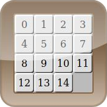

# sliding-puzzle-slider

[Answers can be found here](ANSWERS.md).


## Adding DIVs

You start with this code in the body of your HTML page:
```html
<div id="grid"></div>
```

Could you provide a function called `createCells()` that will add 15 DIVs to the __grid__ and return an array of them?
The text content of the first cell will be "1", the content of the second "2", etc.

## Styling the grid

Could you write the CSS code to get this result? You are not allowed to change the DOM.


## Moving cells

Right now all the cells are overlapping into the upper-left corner.
Could you write a function `move(cell, row, col)` that will __translate__ the cell to the given position `(row, col)`?
* `row` and `col` are integers between 0 and 3 included.
* you must use inline styling.

## Setting up

Could you write the function `setUp(cells)` to put each cell in its position using `move(cell, row, col)`?

|    |    |    |    |
|:--:|:--:|:--:|:--:|
|  0 |  1 |  2 |  3 |
|  4 |  5 |  6 |  7 |
|  8 |  9 | 10 | 11 |
| 12 | 13 | 14 |    |


## Random positions

Could you rewrite the function `setUp(cells)` to get random positions for each cell?
The only constraint is that no cell can overlap another cell.

## Advanced styling

Could write the CSS code to get this result? You are not allowed to change the DOM, nor to use images.



## Promise

Could you write the function `loadImage(url)` which will return a __Promise__ resolving in a HTMLImageElement?

## Solving the game

Explain an algorithm that solves this game by using the minimal possible moves.
