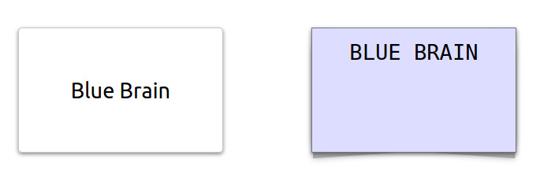

Every box should have 30% of the screen width and 40% of the height.



```
<section>
  <input id="input" value="bablabla"/>
  <div>
    <pre id="output"></pre>
  </div>
</section>
```

----

```
function createDebouncer(f, delay) {
    ...
}
```
